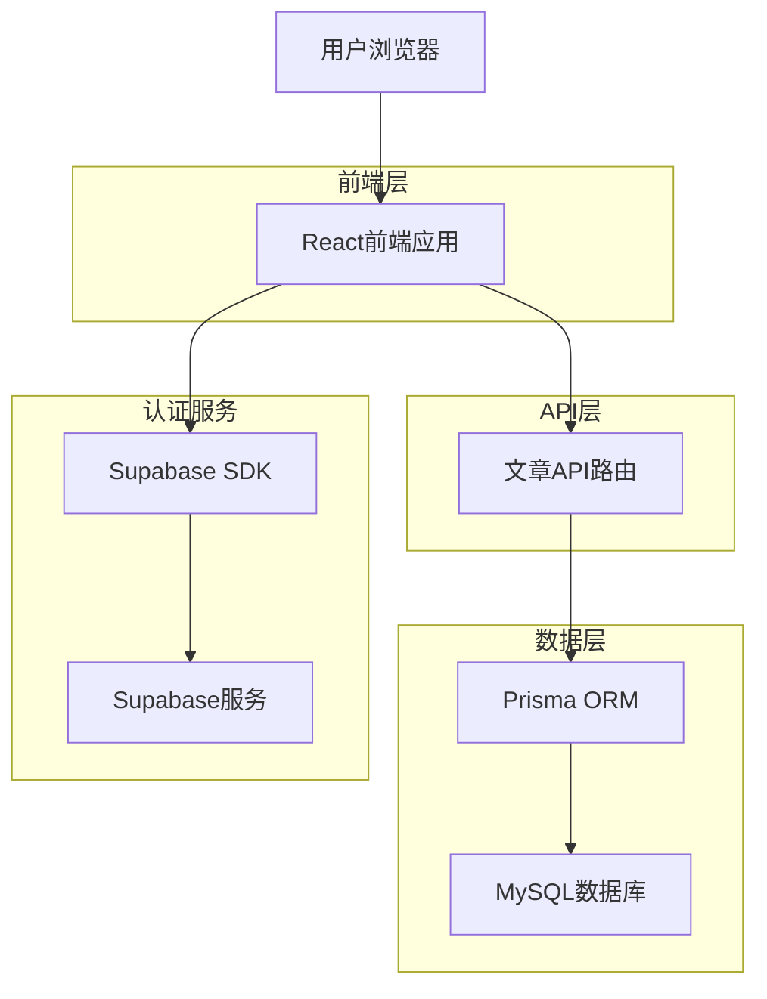
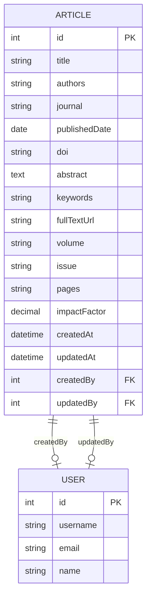

## 1. 架构设计



## 2. 技术描述

- **前端**: React@18 + TypeScript + Tailwind CSS@3 + Vite
- **后端**: Next.js API Routes + Prisma ORM
- **数据库**: MySQL (现有)
- **认证**: Supabase Auth
- **状态管理**: React Hooks (useState, useEffect)

## 3. 路由定义

| 路由 | 用途 |
|------|------|
| /articles | 文章列表页面，展示所有文章并支持筛选搜索 |
| /articles/[id] | 文章详情页面，显示单篇文章的完整信息 |
| /admin | 管理后台页面，包含文章管理功能 |
| /admin/articles/new | 新建文章页面 |
| /admin/articles/[id]/edit | 编辑文章页面 |

## 4. API定义

### 4.1 核心API

**获取文章列表**
```
GET /api/articles
```

查询参数:
| 参数名 | 参数类型 | 是否必需 | 描述 |
|--------|----------|----------|------|
| page | number | false | 页码，默认为1 |
| limit | number | false | 每页数量，默认为10 |
| search | string | false | 搜索关键词 |
| journal | string | false | 期刊名称筛选 |
| author | string | false | 作者筛选 |
| year | number | false | 发表年份筛选 |
| keywords | string | false | 关键词筛选 |

响应:
| 参数名 | 参数类型 | 描述 |
|--------|----------|------|
| data | Article[] | 文章列表 |
| pagination | object | 分页信息 |
| total | number | 总数量 |

**创建文章**
```
POST /api/articles
```

请求体:
| 参数名 | 参数类型 | 是否必需 | 描述 |
|--------|----------|----------|------|
| title | string | true | 文章标题 |
| authors | string | true | 作者列表 |
| journal | string | true | 期刊名称 |
| publishedDate | string | true | 发表日期 |
| doi | string | false | DOI标识符 |
| abstract | string | false | 摘要 |
| keywords | string | false | 关键词，逗号分隔 |
| fullTextUrl | string | false | 全文链接 |
| volume | string | false | 卷号 |
| issue | string | false | 期号 |
| pages | string | false | 页码范围 |
| impactFactor | number | false | 影响因子 |

**更新文章**
```
PUT /api/articles/[id]
```

**删除文章**
```
DELETE /api/articles/[id]
```

**获取单篇文章**
```
GET /api/articles/[id]
```

**批量导入文章**
```
POST /api/articles/import
```

请求体:
| 参数名 | 参数类型 | 是否必需 | 描述 |
|--------|----------|----------|------|
| file | File | true | Excel/CSV文件 |

示例响应:
```json
{
  "data": [
    {
      "id": 1,
      "title": "基于深度学习的药物分子设计新方法",
      "authors": "张三, 李四, 王五",
      "journal": "Journal of Medicinal Chemistry",
      "publishedDate": "2024-01-15",
      "doi": "10.1021/acs.jmedchem.2024.00123",
      "abstract": "本研究提出了一种基于深度学习的药物分子设计新方法...",
      "keywords": "深度学习,药物设计,分子生成,人工智能",
      "impactFactor": 7.446,
      "createdAt": "2024-01-20T10:00:00Z"
    }
  ],
  "pagination": {
    "page": 1,
    "limit": 10,
    "total": 25,
    "hasNext": true,
    "hasPrev": false
  }
}
```

## 5. 服务器架构图

```mermaid
graph TD
    A[客户端/前端] --> B[控制器层]
    B --> C[服务层]
    C --> D[数据访问层]
    D --> E[(MySQL数据库)]
    
    subgraph 服务器
        B
        C
        D
    end
    
    subgraph API路由
        F[GET /api/articles]
        G[POST /api/articles]
        H[PUT /api/articles/[id]]
        I[DELETE /api/articles/[id]]
        J[POST /api/articles/import]
    end
    
    B --> F
    B --> G
    B --> H
    B --> I
    B --> J
```

## 6. 数据模型

### 6.1 数据模型定义



### 6.2 数据定义语言

**文章表 (articles)**
```sql
-- 创建文章表
CREATE TABLE articles (
    id INT PRIMARY KEY AUTO_INCREMENT,
    title VARCHAR(500) NOT NULL COMMENT '文章标题',
    authors TEXT NOT NULL COMMENT '作者列表',
    journal VARCHAR(200) NOT NULL COMMENT '期刊名称',
    published_date DATE NOT NULL COMMENT '发表日期',
    doi VARCHAR(100) UNIQUE COMMENT 'DOI标识符',
    abstract TEXT COMMENT '摘要',
    keywords TEXT COMMENT '关键词，逗号分隔',
    full_text_url VARCHAR(500) COMMENT '全文链接',
    volume VARCHAR(50) COMMENT '卷号',
    issue VARCHAR(50) COMMENT '期号',
    pages VARCHAR(50) COMMENT '页码范围',
    impact_factor DECIMAL(5,3) COMMENT '影响因子',
    created_at TIMESTAMP DEFAULT CURRENT_TIMESTAMP,
    updated_at TIMESTAMP DEFAULT CURRENT_TIMESTAMP ON UPDATE CURRENT_TIMESTAMP,
    created_by INT COMMENT '创建人',
    updated_by INT COMMENT '修改人',
    
    INDEX idx_articles_journal (journal),
    INDEX idx_articles_published_date (published_date DESC),
    INDEX idx_articles_authors (authors(100)),
    INDEX idx_articles_keywords (keywords(200)),
    INDEX idx_articles_created_at (created_at DESC),
    
    FOREIGN KEY (created_by) REFERENCES users(id),
    FOREIGN KEY (updated_by) REFERENCES users(id)
) COMMENT='科学期刊文章表';

-- 创建全文搜索索引
ALTER TABLE articles ADD FULLTEXT(title, abstract, keywords);

-- 初始化示例数据
INSERT INTO articles (
    title, authors, journal, published_date, doi, abstract, keywords, 
    full_text_url, volume, issue, pages, impact_factor, created_by
) VALUES 
(
    '基于深度学习的药物分子设计新方法',
    '张三, 李四, 王五',
    'Journal of Medicinal Chemistry',
    '2024-01-15',
    '10.1021/acs.jmedchem.2024.00123',
    '本研究提出了一种基于深度学习的药物分子设计新方法，通过生成对抗网络(GAN)和变分自编码器(VAE)的结合，实现了具有特定生物活性的分子自动生成。实验结果表明，该方法在药物候选分子的生成效率和质量方面均优于传统方法。',
    '深度学习,药物设计,分子生成,人工智能,GAN,VAE',
    'https://pubs.acs.org/doi/10.1021/acs.jmedchem.2024.00123',
    '67',
    '2',
    '1234-1248',
    7.446,
    1
),
(
    '计算机辅助药物发现中的机器学习应用',
    '李四, 王五, 赵六',
    'Nature Reviews Drug Discovery',
    '2023-12-20',
    '10.1038/s41573-023-00123-4',
    '本综述系统总结了机器学习在计算机辅助药物发现中的最新应用，包括分子性质预测、药物-靶点相互作用预测、药物重定位等关键领域的进展和挑战。',
    '机器学习,药物发现,CADD,分子性质预测,药物重定位',
    'https://www.nature.com/articles/s41573-023-00123-4',
    '23',
    '1',
    '45-62',
    112.288,
    1
);
```

**Prisma Schema 更新**
```prisma
// 在现有 schema.prisma 中添加
model Article {
  id            Int      @id @default(autoincrement())
  title         String   @db.VarChar(500)
  authors       String   @db.Text
  journal       String   @db.VarChar(200)
  publishedDate DateTime @map("published_date") @db.Date
  doi           String?  @unique @db.VarChar(100)
  abstract      String?  @db.Text
  keywords      String?  @db.Text
  fullTextUrl   String?  @map("full_text_url") @db.VarChar(500)
  volume        String?  @db.VarChar(50)
  issue         String?  @db.VarChar(50)
  pages         String?  @db.VarChar(50)
  impactFactor  Decimal? @map("impact_factor") @db.Decimal(5,3)
  createdAt     DateTime @default(now()) @map("created_at")
  updatedAt     DateTime @updatedAt @map("updated_at")
  createdBy     Int?     @map("created_by")
  updatedBy     Int?     @map("updated_by")
  
  // 关联关系
  creator       User?    @relation("ArticleCreatedBy", fields: [createdBy], references: [id])
  updater       User?    @relation("ArticleUpdatedBy", fields: [updatedBy], references: [id])
  
  @@map("articles")
  @@index([journal])
  @@index([publishedDate(sort: Desc)])
  @@index([createdAt(sort: Desc)])
}

// 在 User 模型中添加反向关联
model User {
  // ... 现有字段 ...
  
  // 新增关联关系
  createdArticles Article[] @relation("ArticleCreatedBy")
  updatedArticles Article[] @relation("ArticleUpdatedBy")
  
  // ... 其他关联关系 ...
}
```