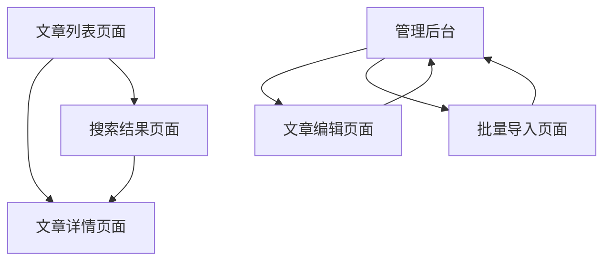

## 1. 产品概述

本项目旨在为实验室网站增加一个独立的文章管理系统，专门用于管理科学期刊文章，与现有的新闻动态系统分离。新系统将提供完整的CRUD功能，支持科学期刊文章的专业化管理和展示。

- 解决问题：当前系统中文章和新闻动态混合管理，缺乏对科学期刊文章的专业化支持
- 目标用户：实验室管理员、研究人员、访问者
- 产品价值：提升学术成果的专业化展示和管理效率

## 2. 核心功能

### 2.1 用户角色

| 角色 | 注册方式 | 核心权限 |
|------|----------|----------|
| 管理员 | 系统分配 | 文章的增删改查、分类管理、审核发布 |
| 访问者 | 无需注册 | 浏览文章、搜索、筛选 |

### 2.2 功能模块

我们的文章管理系统包含以下主要页面：
1. **文章列表页面**：文章展示、分类筛选、搜索功能
2. **文章详情页面**：完整文章信息展示、相关文章推荐
3. **管理后台页面**：文章CRUD操作、批量管理、数据统计

### 2.3 页面详情

| 页面名称 | 模块名称 | 功能描述 |
|----------|----------|----------|
| 文章列表页面 | 文章展示区 | 展示文章卡片，包含标题、作者、期刊、发表日期、摘要预览 |
| 文章列表页面 | 筛选搜索区 | 按期刊、作者、关键词、发表年份筛选和搜索 |
| 文章列表页面 | 分页导航 | 支持分页浏览，每页显示数量可配置 |
| 文章详情页面 | 文章信息展示 | 显示完整的文章信息：标题、作者、期刊名称、发表日期、DOI、关键词、摘要、全文链接 |
| 文章详情页面 | 相关推荐 | 基于关键词和分类推荐相关文章 |
| 管理后台页面 | 文章管理表格 | 文章列表展示、搜索、排序、批量操作 |
| 管理后台页面 | 文章编辑表单 | 创建和编辑文章的表单界面，包含所有必要字段 |
| 管理后台页面 | 批量导入功能 | 支持Excel/CSV格式的批量文章导入 |

## 3. 核心流程

**管理员流程：**
管理员登录后台 → 进入文章管理页面 → 创建/编辑/删除文章 → 设置文章状态 → 保存发布

**访问者流程：**
访问文章列表页面 → 使用筛选和搜索功能 → 点击文章查看详情 → 浏览相关推荐文章

## 4. 用户界面设计

### 4.1 设计风格

- **主色调**：#2563eb (蓝色) 和 #1e40af (深蓝色)
- **辅助色**：#f3f4f6 (浅灰) 和 #6b7280 (中灰)
- **按钮样式**：圆角矩形，悬停效果，阴影设计
- **字体**：Inter, -apple-system, BlinkMacSystemFont, 'Segoe UI', Roboto
- **布局风格**：卡片式布局，响应式网格系统
- **图标风格**：Lucide React 图标库，简洁线性风格

### 4.2 页面设计概览

| 页面名称 | 模块名称 | UI元素 |
|----------|----------|--------|
| 文章列表页面 | 文章卡片 | 白色背景卡片，阴影效果，悬停动画，标题使用#1f2937，摘要使用#6b7280 |
| 文章列表页面 | 筛选器 | 下拉选择框，搜索输入框，标签样式的筛选条件显示 |
| 文章详情页面 | 文章头部 | 大标题，作者信息，期刊徽章，发表日期，DOI链接 |
| 文章详情页面 | 内容区域 | 结构化信息展示，关键词标签，摘要文本区域 |
| 管理后台页面 | 数据表格 | 斑马纹表格，操作按钮组，状态指示器，排序图标 |
| 管理后台页面 | 表单界面 | 标签化输入框，富文本编辑器，文件上传组件 |

### 4.3 响应式设计

- **桌面优先**：主要针对1200px以上屏幕优化
- **移动适配**：768px以下使用单列布局，触摸友好的按钮尺寸
- **平板适配**：768px-1024px使用两列网格布局